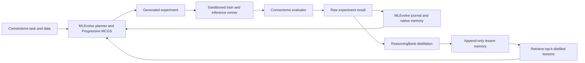

# Connectome AutoML Plan

Status: planning only; no implementation exists in this repository yet.  
Last source check: 2026-09-19.  
Guiding principle: adapt MLEvolve to Connectome, add ReasoningBank-style explicit experiment memory, and avoid redesigning either system.

## 1. Project Overview

Build a small autonomous experimentation loop for the WunderNN Alfa Connectome competition:

1. MLEvolve proposes or modifies a candidate solution.
2. A Connectome runner trains and evaluates it without future leakage.
3. The runner returns the official target scores and combined score in a stable result contract.
4. A ReasoningBank adapter distills a few reusable lessons from a meaningful completed experiment.
5. Lessons are persisted and a small relevant subset is retrieved before later MLEvolve planning calls.
6. MLEvolve receives those lessons as optional evidence and remains responsible for choosing the next experiment.

The system is an adapter around upstream projects, not a fork-wide rewrite. Progressive MCGS, node selection, branch evolution, fusion, exploration/exploitation, coding agents, and MLEvolve's raw node history remain unchanged unless an integration test proves a change is necessary.

### Repository finding

At planning time this workspace contains only `AGENTS.md`. It has no dataset, starter kit, evaluation code, notes, MLEvolve checkout, ReasoningBank checkout, Git metadata, or Graphify graph. Consequently:

- Competition facts below are sourced from the official Connectome documentation.
- Architecture notes are based on upstream MLEvolve commit `9c5c8a3b23f0361708b59a401452dddc00f97189` and ReasoningBank commit `ed80611788292ea739f1effd31f16c53823b8a0d`.
- All proposed local paths are provisional until the upstream projects and competition package are added.
- The official starter-kit scorer must be copied or wrapped, not reconstructed from this document alone.

## 2. Research Question

Primary question:

> Under the same Connectome data, validation protocol, model access, initial prompt, MLEvolve settings, random seeds, and experiment/compute budget, does adding explicit ReasoningBank lesson distillation and retrieval improve MLEvolve's search efficiency or best official validation score?

Hypotheses:

- H1: MLEvolve + ReasoningBank reaches a higher best combined Global Weighted Pearson score.
- H2: It reaches a fixed score threshold in fewer completed experiments.
- H3: It repeats fewer materially equivalent failed or unproductive experiments.
- H4: Retrieved lessons can be traced to later plans and successful experiments without forcing the agent to obey them.

The independent variable is the explicit distilled-lesson layer. Current MLEvolve already has node-level global memory, so its `use_global_memory` setting and all other search settings must be identical in both arms. Record the chosen setting before a run; do not silently compare MLEvolve without its native memory against MLEvolve plus ReasoningBank.

## 3. Connectome Competition

The task is sequential regression over anonymized market states for two related instruments, `i0` and `i1`. Each row exposes 112 `float32` features. The model predicts two future-movement indicators for `i0`, returned in `[t0, t1]` order.

Official behavior that every candidate must preserve:

- Process rows in the supplied order.
- Use only the current row and earlier rows from the same sequence.
- Update state on every row, including warm-up and unscored rows.
- Reset all sequence state when `seq_ix` changes.
- Do not use `seq_ix` as a feature or chronological ordering key.
- Return `None` during warm-up (`need_prediction == false`).
- Return exactly two finite, `float32`-compatible predictions whenever `need_prediction == true`.
- Treat the hidden scoring mask as unknowable at inference time.

Sources: [official data overview](https://wundernn.io/connectome/docs/data_overview), [official submission guide](https://wundernn.io/connectome/docs/submission_guide), and [official FAQ](https://wundernn.io/connectome/docs/faq).

## 4. Dataset and Constraints

### Verified official facts

| Item | Value |
|---|---:|
| Input features | 112 |
| Targets | `t0`, `t1` |
| Rows per sequence | 20,000 |
| Warm-up steps | 0-98 inclusive (99 rows) |
| Prediction steps | 99-19,999 inclusive |
| Training sequences / rows | 10,607 / 212,140,000 |
| Validation sequences / rows | 1,873 / 37,460,000 |
| Current hidden test sequences / rows | 1,970 / 39,400,000 |
| Training columns | 117 |
| Validation columns | 118 |

Each Parquet row group is one full sequence. Read by row group for streaming experiments rather than loading hundreds of millions of rows at once.

The 112-feature order is fixed: 52 features for `i0`, 52 for `i1`, then `a0` through `a7`. Never alphabetically sort feature names because names such as `p10` would be misplaced. The official documentation also warns that feature indices are stable identifiers, not guaranteed order-book depth rankings.

Files expected from the participant package:

- `datasets/train.parquet`: features, `t0`, `t1`; no official scoring mask.
- `datasets/valid.parquet`: features, targets, and `is_scored`.
- `datasets/valid_mask.parquet`: `(seq_ix, step_in_seq, is_scored)` duplicate of the validation mask.
- Starter-kit `utils.py`, baseline solution, scorer, dependency list, and any local evaluation harness.

Before implementation, verify file hashes, schemas, dtypes, row-group boundaries, sequence counts, missing/non-finite values, and equality of the two validation-mask representations against the downloaded package.

## 5. Official Evaluation Metric

The primary objective is the official combined **Global Weighted Pearson correlation**, not ordinary Pearson, row-wise loss, per-sequence correlation, or an average of sequence scores.

For one target, select all rows where `need_prediction AND is_scored` is true across all validation sequences. Pool these rows globally. For selected target values `y_i` and predictions `p_i`:

1. Clip both: `y_i <- clip(y_i, -2, 2)` and `p_i <- clip(p_i, -2, 2)`.
2. Set target-dependent weights: `w_i = abs(y_i)`.
3. Compute weighted means:

   `mu_y = sum(w_i * y_i) / sum(w_i)`

   `mu_p = sum(w_i * p_i) / sum(w_i)`

4. Compute weighted correlation:

   `rho_w = sum(w_i * (y_i - mu_y) * (p_i - mu_p)) / sqrt(sum(w_i * (y_i - mu_y)^2) * sum(w_i * (p_i - mu_p)^2))`

5. Compute this separately as `WP_t0` and `WP_t1`.
6. The official combined score is:

   `combined_WP = (WP_t0 + WP_t1) / 2`

The evaluator must emit at least `WP_t0`, `WP_t1`, and `combined_WP`, with `combined_WP` as MLEvolve's maximize metric. It may also emit split scores, runtime, artifact size, and training time as diagnostics, but those must not replace the official objective.

### Metric parity gate

Implementation must vendor or call the official scorer from the downloaded starter kit. Add a small parity test covering clipping, masking, target-dependent weights, global pooling, both targets, and a deliberately different ordinary-Pearson result. Also determine the official behavior for zero total weight, zero weighted variance, NaN/Inf inputs, dtype/accumulation precision, and empty masks. Those edge behaviors are **not verified** by the public prose and must match starter code byte-for-byte or numerically within an explicit tolerance.

## 6. Existing MLEvolve Architecture

Source: [upstream MLEvolve](https://github.com/InternScience/MLEvolve) at the commit recorded above.

Relevant components:

| Upstream component | Current responsibility | Planned treatment |
|---|---|---|
| `engine/agent_search.py` | Coordinates search steps, calls draft/debug/improve/evolution/fusion agents, executes candidates, parses results, updates the journal and best node | Preserve; provide a Connectome task description and execution callback |
| `engine/search_node.py` | Stores node plan, code, metric, status, parent/branch relationships and prompts | Preserve; attach experiment IDs through the least invasive existing metadata path |
| `engine/executor.py`, `engine/execution.py` | Runs generated code and validates execution state | Reuse; point execution at a bounded Connectome workspace |
| `agents/result_parse_agent.py` | Parses execution output, sets metric/bug state, performs leakage checks, and saves valid nodes to native memory | Adapt only the result contract needed for Connectome's scalar combined score and diagnostics |
| `engine/evaluation.py` | Converts metric improvement into search reward and backpropagates it | Preserve; declare combined WP as maximize |
| `agents/draft_agent.py`, `improve_agent.py` | Build planning/generation context and candidate nodes | Add a bounded optional `Distilled lessons` context block at the existing planning boundary |
| `agents/planner/planner_with_memory.py` | Two-stage plan generation; retrieves similar native success/failure node records before structured refinement | Preserve native behavior; inject ReasoningBank lessons separately so provenance is measurable |
| `agents/memory/*` | Stores raw-ish node experience and retrieves via BM25 + vector search | Keep the same configuration in both research arms |
| `engine/solution_manager.py` | Tracks best and top candidate solutions | Preserve |

Current MLEvolve defaults `use_global_memory: True`. Its `MemRecord` contains a plan description, code summary, stage-derived title, success/neutral/failure label, and timestamp. Its planner retrieves successful and failed similar records. This is useful but conceptually different from the proposed layer: ReasoningBank should distill compact, evidence-bearing lessons from complete Connectome experiment outcomes.

MLEvolve's execution path expects generated candidate code to print parseable evaluation output and produce submission artifacts in its workspace. The Connectome adapter should satisfy that contract rather than alter MCGS internals.

## 7. Existing ReasoningBank Architecture

Source: [upstream ReasoningBank](https://github.com/google-research/reasoning-bank) at the commit recorded above.

The released repository supplies integrations for SWE-Bench and WebArena rather than a general installable memory service. Its reusable pattern is:

1. Load a JSONL memory bank.
2. Build a retrieval query from the current task.
3. Retrieve a small top-N set using cached embeddings and cosine similarity.
4. Insert selected memory text into the agent context.
5. Run the agent and preserve its trajectory.
6. Judge success/failure.
7. Use separate successful/failed prompts to distill at most three concise, non-overlapping memory items.
8. Append the query, status, and memory items to JSONL; maintain embedding cache entries for retrieval.

Relevant upstream files are `third_party/src/minisweagent/memory/memory_management.py`, `instruction.py`, `induce_memory.py`, and `run/extra/swebench.py`, plus parallel counterparts under `WebArena/`.

For Connectome, objective score deltas replace the generic LLM success judge: an experiment is improved, regressed, tied, invalid, or failed according to execution status and official metric deltas. The LLM distills the lesson, but it does not decide the numeric outcome.

Keep the core ReasoningBank pattern, not its domain-specific dependencies. In particular, do not import the SWE-Bench runner or WebArena stack. A thin adapter should reuse the prompts/schema and retrieval semantics that are practical for this project.

## 8. Proposed Combined Architecture



There are two durable records:

- **Raw experiment record:** authoritative plan, parent, code/artifact references, stdout/stderr, seeds, environment, scores, timings, constraints, and status. Never replace or rewrite it with an LLM summary.
- **Distilled lesson:** compact derived guidance with provenance back to one or more raw experiment IDs. It may be regenerated or superseded without losing evidence.

Minimum interfaces:

- `run_experiment(candidate, run_config) -> ExperimentResult`
- `distill(result, parent_result?) -> list[Lesson]`
- `retrieve(query, k) -> list[RetrievedLesson]`
- `format_for_prompt(retrieved) -> str`

These are conceptual contracts for planning; implementation should use existing upstream call shapes where possible rather than introduce an interface hierarchy.

## 9. Connectome-Specific MLEvolve Changes

### Task description

Give every relevant MLEvolve agent one authoritative task block containing:

- Dataset schema and exact ordered feature groups.
- Independent 20,000-row sequences and the 99-row warm-up.
- Causality rule and mandatory reset on `seq_ix` change.
- `t0`/`t1` output order and finite-output requirement.
- Official global, masked, clipped, target-weighted Pearson formula.
- CPU, time, RAM, offline, determinism, and ZIP-size constraints.
- Local file layout and allowed dependencies from the actual starter kit.
- The rule that evaluation code, masks, and held-out targets are immutable.

### Experiment execution

The existing `exec_callback` boundary in `AgentSearch` is the primary adapter point. Candidate code should run in an isolated per-node directory, read immutable data, write its artifacts/results only inside that directory, and return stdout/stderr plus resource status in MLEvolve's existing `ExecutionResult` form.

Require a final machine-readable result line or JSON artifact with a versioned minimal schema:

```json
{
  "status": "success",
  "primary_metric": 0.207,
  "metric_name": "combined_WP",
  "maximize": true,
  "metrics": {"WP_t0": 0.201, "WP_t1": 0.213, "combined_WP": 0.207},
  "runtime_seconds": 123.4,
  "artifact_bytes": 456789
}
```

`primary_metric` exists for MLEvolve compatibility; the named metrics prevent loss of target-specific information. Failed, timed-out, invalid, non-finite, leaky, or constraint-violating runs must not receive a fabricated low valid score.

### Evaluation and leakage prevention

- Keep evaluator code and masks outside candidate-writable paths.
- Split on whole `seq_ix` values only; never split rows within a sequence across train/validation.
- Compute features causally within each sequence. Any normalization, imputation, feature selection, calibration, or learned transform must fit on training partitions only.
- Do not expose validation targets or `is_scored` to the inference callback.
- Replay candidates row by row through the submission interface for final local evaluation, including state reset and warm-up behavior.
- Retain MLEvolve's leakage-review step, but treat deterministic programmatic checks as the authority.
- Reject use of external data and prohibit network access during candidate execution.

### Changes explicitly out of scope

- No new search algorithm.
- No rigid model or hyperparameter search space.
- No rewrite of node selection, UCT/reward propagation, branch evolution, fusion, or stagnation logic.
- No requirement that MLEvolve follow retrieved lessons.
- No production memory database, service, UI, or distributed scheduler.

## 10. ReasoningBank Integration

### Distillation input

After a meaningful experiment completes, pass a bounded evidence packet containing:

- Experiment ID and parent ID.
- Hypothesis/plan and concise code-change summary.
- Model/architecture and experiment category if known.
- Parent and current `WP_t0`, `WP_t1`, and combined score.
- Absolute score deltas and improved/regressed/tied/invalid/failed status.
- Validation split/protocol ID and seed.
- Runtime, artifact size, and constraint violations.
- Relevant execution analysis, truncated to a configured limit.
- IDs of lessons retrieved for this experiment.

Distill only completed experiments that add information. Skip infrastructure failures with no modeling lesson, exact reruns, and malformed results. Failed modeling experiments may yield prevention lessons; successful experiments may yield reusable strategies. Limit output to at most three non-overlapping lessons, matching upstream ReasoningBank's discipline.

### Minimal lesson record

```json
{
  "lesson_id": "stable-id",
  "source_experiment_ids": ["exp-0042"],
  "status": "improved",
  "title": "Short-lag cross-instrument state helped a GRU",
  "content": "Adding causal short-lag i1 features improved both target scores on split v1; retest on another split before generalizing.",
  "model": "GRU",
  "category": "feature-engineering",
  "targets": ["t0", "t1"],
  "score_delta": 0.023,
  "tags": ["temporal", "cross-instrument"],
  "validation_protocol": "split-v1",
  "created_at": "ISO-8601"
}
```

Only `lesson_id`, provenance, status, content, and creation time need be mandatory. Optional metadata should improve filtering or auditability without creating a taxonomy project.

### Retrieval and prompt injection

Build the query from the task, current parent plan/model, recent failure or improvement context, target emphasis, and candidate experiment category. Retrieve a small configurable number, initially `k=3`, using the closest practical upstream ReasoningBank embedding path. Record query text, ranked IDs, scores, and the exact prompt block.

Prompt wording must frame lessons as evidence:

> Prior experiment lessons are fallible observations from specific validation contexts. Consider them when useful, verify applicability, and choose the next experiment independently.

Do not retrieve lessons from the experiment currently being planned. For unbiased research runs, memory begins empty and may contain only experiments completed earlier in that arm. Never seed the experimental arm with results unavailable to the baseline at the equivalent budget point.

### Relationship to MLEvolve native memory

Keep stores and labels separate:

- MLEvolve native memory: node-level plan/code summary plus search labels, used by its existing planner and debug flows.
- ReasoningBank memory: distilled, evidence-bearing lesson text plus Connectome score provenance.

Insert the ReasoningBank block at MLEvolve's existing planning prompt boundary. Avoid modifying native BM25/FAISS record formats in the first implementation. This separation produces a clean feature flag and an auditable ablation.

## 11. Experiment Lifecycle

1. **Select:** MLEvolve selects a parent/node through unchanged search logic.
2. **Retrieve:** If the ReasoningBank arm is enabled, construct and log the query, retrieve top-k prior lessons, and format an optional prompt block.
3. **Plan:** MLEvolve proposes a free-form modeling experiment; no fixed search space constrains it.
4. **Generate/review:** Existing agents generate and review candidate code, including leakage checks.
5. **Train:** Execute in a clean node workspace with fixed data mounts, seed, timeout, and resource accounting.
6. **Replay:** Run validation through the row-wise `PredictionModel.predict` contract with sequence resets and warm-up calls.
7. **Score:** Use the official masked global WP scorer and emit the stable result contract.
8. **Record:** Append the immutable raw result before any LLM distillation call.
9. **Update search:** Feed `combined_WP` and diagnostics through existing MLEvolve parsing/evaluation.
10. **Distill:** For meaningful results, generate up to three lessons linked to raw evidence.
11. **Index:** Persist lessons and retrieval representations atomically.
12. **Continue:** The next eligible planning call can retrieve the new lessons.

Crash recovery should resume from durable raw records and never count a partially written result as completed. A distillation failure must not discard or invalidate a valid experiment.

## 12. Validation Strategy

### Initial development protocol

Use the official validation set and `is_scored` mask first to establish scorer parity and an end-to-end baseline. This is the comparability anchor, not sufficient evidence of generalization.

### Search protocol

Define whole-sequence train/validation partitions with fixed, versioned manifests. Because official documentation says sequences are independent and shuffled, sequence-level random splits are permissible; use fixed seeded splits and never infer chronology from `seq_ix`.

A minimal robust protocol is:

- One fixed search split for every inner-loop experiment.
- One secondary whole-sequence confirmation split evaluated only for promising candidates, to reduce visible-mask overfitting.
- The official provided validation/mask as a final local benchmark, with evaluation frequency fixed across research arms.

Do not let one arm access confirmation results more often than the other. If compute permits multiple seeds or folds, predeclare them and aggregate them identically in both arms. The official combined score remains the optimization target; robustness summaries are diagnostics.

### Causality tests

The evaluator test suite must include:

- Perturbing future rows does not change earlier predictions.
- Reordering or replacing other sequences does not change a sequence's predictions.
- Replaying one sequence after another produces the same predictions as replaying it from a fresh model instance.
- Warm-up rows update state but emit `None`.
- Every required row emits two finite values in the correct order.
- Batched/offline validation agrees with row-wise submission replay when both paths are supported.

## 13. Competition Runtime/Submission Constraints

Verified from the official submission guide:

| Resource/interface | Official limit |
|---|---:|
| Runtime | Python 3.11, isolated Linux |
| CPU | 1 vCPU |
| RAM | 16 GB |
| GPU | None |
| Inference time | 60 minutes for the entire current test set |
| Uploaded ZIP | 20 MB |
| Internet | Disabled |
| Entry point | Root-level `solution.py` |
| API | No-argument `PredictionModel`; `predict(data_point)` |

The current test has 39.4 million rows, implying an end-to-end average budget of about 91 microseconds per callback, including Python overhead, state updates, and prediction, if the full 60 minutes is available solely to inference. Treat that number as a planning diagnostic, not an additional official rule.

Every candidate should record approximate replay throughput, peak memory where available, serialized artifact size, deterministic repeatability, and ZIP size. Run a representative final benchmark inside the official or faithfully reproduced Docker image on one CPU core. Fast subset benchmarks may prune obviously infeasible candidates but cannot certify compliance.

## 14. Baseline vs Proposed Research Experiment

### Arms

- **A: MLEvolve baseline.** Upstream MLEvolve adapted to the Connectome runner/evaluator; no distilled lesson retrieval or distillation.
- **B: MLEvolve + ReasoningBank.** Identical system with explicit lesson distillation, storage, retrieval, and prompt context enabled.

### Controlled variables

Hold constant:

- Upstream commits and local adapter commit.
- MLEvolve native-memory setting.
- LLM provider/model/version, system prompts except the lesson block, temperature, and tool access.
- Dataset and split manifests.
- Starting candidate/baseline and initial task description.
- Search configuration, branch count, experiment count, wall-clock/compute budget, concurrency, and candidate timeouts.
- Random seeds or a predeclared seed schedule.
- Evaluator, metric implementation, constraint checks, and confirmation-evaluation policy.

Use paired runs by seed where feasible. Run order should be randomized or interleaved to reduce time/provider drift. Preserve every prompt, response, candidate, result, retrieval event, and lesson needed to reproduce the comparison, subject to credential and sensitive-data hygiene.

### Fair budget accounting

Report both model-experiment compute and agent overhead. Predeclare whether ReasoningBank LLM/embedding calls count against the same wall-clock/token budget; the primary comparison should count them, because they are part of the proposed system. A secondary normalized view may compare equal numbers of completed model experiments.

### Attribution

Trace retrieval rather than asking only whether memory existed. For each later plan, store retrieved lesson IDs and detect explicit references or semantic alignment as a descriptive measure. For high-value cases, manually audit whether the lesson was applicable and whether the plan actually used it. Do not claim causal lesson use from retrieval alone.

## 15. Metrics We Will Track

### Primary outcome

- Best `combined_WP` reached within the fixed budget.

### Required score series

- `WP_t0`, `WP_t1`, and `combined_WP` per valid experiment.
- Best-so-far combined WP versus completed experiment number.
- Best-so-far combined WP versus elapsed wall time and cumulative compute.
- Final best score and area under the best-so-far curve.
- Experiments/time to predeclared score thresholds.

### Search behavior

- Completed, failed, invalid, timed-out, and constraint-violating experiments.
- Repeated or near-duplicate experiment rate, using a documented plan/code similarity rule.
- Improvement rate and distribution of score deltas.
- Branch diversity and lesson reuse across branches.

### Memory behavior

- Lessons created per experiment and total memory size.
- Retrieval count, latency, top-k scores, and retrieved IDs.
- Fraction of experiments receiving lessons.
- Fraction of successful experiments with a retrieved lesson plausibly used.
- Lesson provenance depth, reuse count, and contradictions across validation protocols.
- Distillation/retrieval token and embedding cost.

### Deployment diagnostics

- Training time, row-replay inference time, rows/second, peak RAM, artifact bytes, ZIP bytes, and deterministic replay result.

Report distributions and paired differences across runs, not only the single best anecdote. Choose thresholds, number of seeds, and statistical summaries before seeing comparative results.

## 16. Proposed Repository/File Structure

Use the upstream layout once it is added and introduce the fewest Connectome-specific files practical. A likely structure is:

```text
.
|-- CONNECTOME_AUTOML_PLAN.md
|-- upstream/                    # or git submodules/vendor paths; decision pending
|   |-- mlevolve/
|   `-- reasoning_bank/
|-- connectome/
|   |-- task.md                  # authoritative agent task description
|   |-- runner.py                # candidate execution and result contract
|   |-- evaluator.py             # thin wrapper around official scorer
|   |-- memory.py                # distill/retrieve adapter and JSONL persistence
|   `-- prompts.py               # success/failure lesson prompts and prompt block
|-- tests/
|   |-- test_metric.py
|   |-- test_causality.py
|   `-- test_memory_loop.py
|-- configs/
|   |-- baseline.yaml
|   `-- reasoning_bank.yaml
|-- manifests/                   # immutable sequence splits and run manifests
|-- data/                        # ignored; participant dataset/starter kit
`-- runs/                        # ignored; raw experiments, lessons, retrieval logs
```

This is a target map, not a mandate to create every file. Collapse files when upstream hooks make a separate module unnecessary. Do not copy whole upstream repositories into bespoke wrappers if submodules or pinned dependencies suffice.

## 17. Implementation Phases

Each phase ends in a runnable checkpoint. Do not begin the comparative research run until all earlier gates pass.

### Phase 0: Acquire and pin authoritative inputs

**Work:** Add/pin MLEvolve and ReasoningBank, download the official participant package, record hashes/versions, inspect licenses, and resolve the open items in Section 19.

**Acceptance:** Exact source commits and dataset/starter-kit hashes are recorded; official scorer and submission API files are present; no competition file is silently replaced by an assumption.

**Verification:** Inventory script or documented commands reproduce schemas, counts, row groups, masks, and dependency versions.

### Phase 1: Establish metric parity and causal replay

**Work:** Wrap the official scorer and create a row-wise replay harness for `PredictionModel`.

**Acceptance:** Reports `WP_t0`, `WP_t1`, and their official mean; matches official baseline outputs; enforces warm-up, reset, output shape, finiteness, and immutable hidden fields.

**Verification:** Focused metric and causality tests pass, including a fixture where ordinary Pearson differs from Global WP.

### Phase 2: Run one Connectome experiment through MLEvolve

**Work:** Supply the task description and adapt the existing execution/result boundary without changing search policy.

**Acceptance:** One generated candidate trains, replays, scores, writes raw artifacts, and updates a MLEvolve node with `combined_WP` as maximize.

**Verification:** A deterministic smoke run produces the same predictions and scores twice; failed/timeout/invalid cases remain distinguishable.

### Checkpoint A

- Official scorer parity demonstrated.
- Future-leak and sequence-reset tests pass.
- One baseline search step completes end to end.
- Raw result can reconstruct every reported score.

### Phase 3: Add append-only ReasoningBank distillation

**Work:** Map completed `ExperimentResult` evidence into the upstream successful/failed lesson prompts, use objective score status, and append provenance-linked lessons.

**Acceptance:** Improved and regressed fixtures produce bounded lessons; irrelevant infrastructure failures produce none; raw records survive distillation failure.

**Verification:** A small fixture test validates schema, provenance, maximum item count, append/reload behavior, and atomic failure handling.

### Phase 4: Add retrieval at the planning boundary

**Work:** Index lessons, retrieve `k=3`, log rankings, and insert an optional evidence block into existing MLEvolve planning context.

**Acceptance:** Feature-off prompts are unchanged; feature-on prompts contain only prior eligible lessons with IDs/provenance; no search algorithm code changes.

**Verification:** A synthetic memory bank retrieves the expected relevant lesson, excludes future/current-arm records, and records the exact injected text.

### Checkpoint B

- Baseline mode remains behaviorally unchanged apart from Connectome adaptation.
- Experimental mode completes retrieve-plan-run-score-distill-index.
- Stores are separate and every lesson/retrieval links to raw evidence.

### Phase 5: Benchmark deployment compliance

**Work:** Package best candidates and replay representative/full workloads in the official-equivalent one-core offline container.

**Acceptance:** Entry point, output API, determinism, RAM, runtime, dependencies, and 20 MB ZIP limit are measured rather than inferred.

**Verification:** Two identical full replays match predictions; packaging validator and timed container run pass.

### Phase 6: Run the controlled research comparison

**Work:** Freeze protocol/configs, execute paired baseline and ReasoningBank runs, and generate predefined tables/plots.

**Acceptance:** Equal budgets and controls are auditable; failures are retained; best-score/search-efficiency/memory-use outcomes are reported without cherry-picking.

**Verification:** Run manifest completeness check passes and every plotted point traces to a raw result.

## 18. Risks and Failure Modes

| Risk | Consequence | Mitigation / gate |
|---|---|---|
| Ordinary Pearson or per-sequence averaging is used | Search optimizes the wrong objective | Official scorer wrapper plus adversarial parity test |
| Future rows influence features or fitting | Invalid optimistic scores | Whole-sequence splits, causal replay, future-perturbation test |
| State crosses sequence boundaries | Leakage and deployment mismatch | Mandatory reset test and fresh-instance equivalence |
| Visible `is_scored` mask is overfit | Weak hidden-test performance | Hidden-mask-like secondary splits and fixed confirmation policy |
| Target clipping/weights are applied incorrectly | Metric drift | Test clipping of both target and prediction; weights from clipped target; verify against starter code |
| Candidate can edit evaluator/mask | Invalid search feedback | Read-only authoritative evaluator/data mounts and isolated workspaces |
| MLEvolve native memory differs between arms | Confounded ablation | Pin identical setting/config and log it |
| ReasoningBank repeats raw MLEvolve memory | Extra cost with little signal | Separate distilled schema, compact top-k, measure incremental value |
| LLM distillation invents causality | Misleading lessons compound | Include numeric evidence/provenance and phrase lessons as bounded observations |
| Stale or contradictory lessons dominate | Search converges prematurely | Small top-k, validation-protocol metadata, advisory prompt wording, contradiction audit |
| Memory leaks information across arms or future steps | Invalid experiment | Separate run-scoped stores and eligibility cutoff by completion order |
| Retrieval overhead consumes the budget | Apparent quality gain hides inefficiency | Count tokens, latency, embeddings, and wall time in primary budget |
| Candidate is accurate but too slow/large | Cannot submit | Early subset pruning and final official-container benchmark |
| Full data makes iteration too expensive | Too few experiments | Versioned representative development subsets, then confirmation/full replay |
| Non-deterministic libraries or concurrency | Noisy comparison | Fixed seeds/threads, deterministic replay, environment capture |
| Upstream APIs change | Adapter breaks or research drifts | Pin commits and keep integration at narrow existing boundaries |

## 19. Open Questions / Items Requiring Verification

Resolve these against the downloaded official package and pinned source before implementation or research claims:

- [ ] Confirm the official scorer implementation and its exact zero-weight, zero-variance, empty-mask, NaN/Inf, dtype, and numeric-tolerance behavior.
- [ ] Confirm current official train/validation/test file hashes, shapes, row-group layout, and whether the published counts have changed since 2026-09-19.
- [ ] Confirm that clipping occurs before `w_i = abs(y_i)` in the actual scorer, as implied by the official prose/formula.
- [ ] Confirm the installed scorer-image package list and versions; the public guide shows the environment shape but not the full `requirements.txt`.
- [ ] Confirm whether model initialization time is included in the 60-minute limit and how peak memory/timeouts are measured.
- [ ] Confirm the exact ZIP-size measurement and whether any uncompressed/artifact limits also apply.
- [ ] Confirm competition rules for generated code, LLM use, pre-trained weights, and retaining/using `valid.parquet` for training.
- [ ] Decide how upstream repositories will be pinned locally: submodules, subtree/vendor copies, or package references.
- [ ] Verify MLEvolve's checked-out execution and result-parser contracts after pinning; upstream currently assumes Kaggle-style CSV artifacts that may need a narrow Connectome override.
- [ ] Decide whether native MLEvolve global memory is enabled in both arms. The upstream default is enabled; either choice is valid only if identical and reported.
- [ ] Select the embedding backend supported by the available environment/API. Preserve ReasoningBank-style semantic retrieval without pulling its SWE-Bench/WebArena stacks into this project.
- [ ] Predeclare `k`, lesson eligibility, score tie tolerance, meaningful-experiment criteria, seed schedule, split manifests, run count, budgets, thresholds, and statistical summaries.
- [ ] Establish a simple baseline candidate and reproduce its official local score before permitting autonomous modifications.
- [ ] Confirm whether dataset terms permit storing prompts/code/results in the intended experiment logging location.

### Definition of ready for implementation

Implementation may start when Phase 0 inputs exist, the metric ambiguities above are resolved from official code, the research controls are frozen in configuration, and this plan has been reviewed. Until then, numerical limits stated here should be rechecked because the official FAQ says competition information may be updated.

## References

- [WunderNN Connectome data overview](https://wundernn.io/connectome/docs/data_overview)
- [WunderNN Connectome submission guide](https://wundernn.io/connectome/docs/submission_guide)
- [WunderNN Connectome FAQ](https://wundernn.io/connectome/docs/faq)
- [MLEvolve source](https://github.com/InternScience/MLEvolve)
- [ReasoningBank source](https://github.com/google-research/reasoning-bank)
